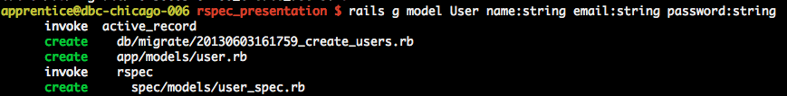
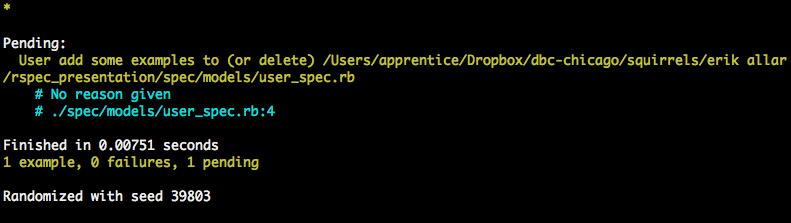
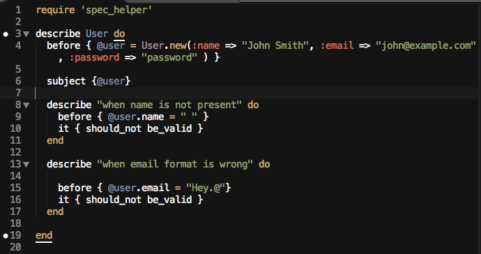
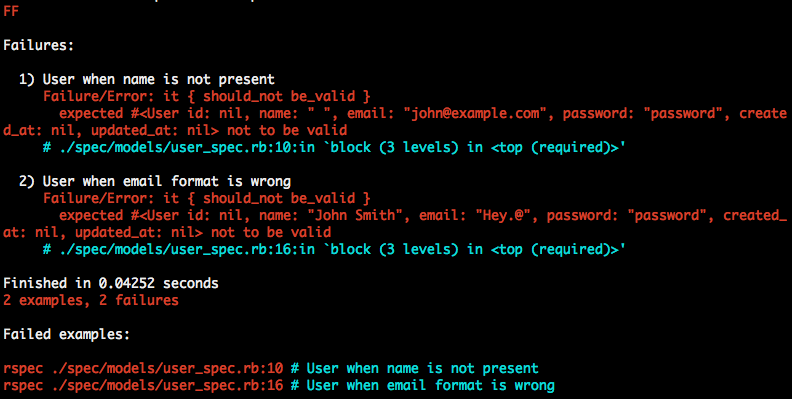
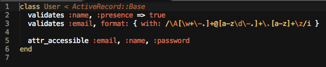
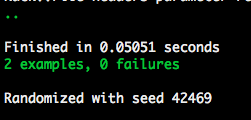

# Test Driven Development

From Wikipedia:

- Test Driven Development is a software development process that is focuses on the developer writing failing tests for the functionality they wish to have in their app, then writing code that will cause the tests to pass, providing the desired functionality, and finally, refactoring the code to make it faster.

- TDD encourages simple designs and inspires confidence.

# No Testing vs TDD

Not writing tests

- Pros:
  - Fast Deployment
  - Shorter ideation to code cycle
  - Less overall code
  - Save time by focusing on the application code instead of test code.
  
- Cons:

  - Sacrifice reliability for speed.
  - Difficult to tell if code changes break distant parts of the application.
  - Testing code in browser repeatedly adds time.
  - Tracing problems throughout the app will chew into productivity.
  
 Writing tests
 
 - Pros: 
 	- Easier to maintain codebase.
 	- Faster feedback loop when writing new code.
 	- Helps developers focus on smaller aspects of the code rather than constantly thinking of the entire system.
 	- Parallel efforts without conflict. 
      - less opportunity to disrupt or destroy others work by being on 		 the same page.
 - Cons: 
 	- More Test Code 
 	- Learning Curve 
 	- Test Maintenance 
	- Adds Complexity
	- Huge Time Investment

## Neat stuff you get to use with TDD! 
-  <a href="https://github.com/rspec/rspec">**RSpec**</a> - Testing Framework for Behaviour Driven Development for Ruby
-  <a href="http://jnicklas.github.io/capybara/">**Capybara**</a> - Helps you test web applications by simulating how a real user would interact with your app.
- <a href="https://github.com/thoughtbot/factory_girl">**Factory Girl**</a> - A library for setting up Ruby objects as test data.
- <a href="https://github.com/guard/guard">**Guard**</a> - Guard is a command line tool to easily handle events on file system modifications. 
- <a href="https://github.com/sporkrb/spork">**Spork**</a> - A DRb server for testing frameworks (RSpec / Cucumber currently) that forks before each run to ensure a clean testing state. 
	- Creates a new fork of Rails Environment to run tests against rather than having Rails load and reload the files for tests. 
  
## Create New Rails App with Rspec.


To generate a new rails app without including the default testing framework Test::Unit.

Run:
   
    rails new myapp --skip-test-unit'

or
 
    rails new myapp -T


- Now, in your `Gemfile` add this block to the bottom to include RSpec. Notice we only want to include RSpec in our development and test environments.
	
```
group :development, :test do
	 gem 'rspec-rails'
end
```


Now run the `bundle` command

Next we need to run RSpec's 'generator' that rspec-rails has put in place for us
 
run `rails generate rspec:install`

This command will:
	
- create a `spec` in the root of our application in which we can store and organize our test files, called `specs`

- create an `.rspec` file where we store configuration options for the rspec command line tool. For configuration options see <a href="http://rubydoc.info/github/rspec/rspec-core/RSpec/Core/Configuration">here</a>.

- create a `spec/spec_helper.rb` file that will be loaded in every spec by having `require 'spec_helper'` at the top. This is included automatically in generated spec files.  


## Create a Test Model
    
Generate a model to test

`rails generate model User name:string email:string password:string`



Rails will automatically generate a spec file for this model and place it in the `spec/models` directory. Pretty Neat!

Now we can run `rake db:migrate` to migrate the database.

And finally run `bundle exec rspec` to run the test suite and see that there is nothing there.



Now that we generated a model above, let's write a few specs to test the basic features of out User model.

So let's write some tests to model some basic validations we want our User model to have.

First we start by writing failing tests.



We can see that these tests fail by running `bundle exec rspec`.



Now let's write some code to make our failing tests pass by adding some validations on our user model.



Now if we run our test suite again with `bundle exec rspec` they should be passing with some nice green text. 



How neat is that? 

## Resources

- <a href="http://www.slideshare.net/jasonjnoble/rspec-101">RSpec-101</a>
- <a href="http://www.rubyinside.com/how-to-rails-3-and-rspec-2-4336.html">Ruby Inside RSpec Setup Guide</a>
- RSpec was written by <a href="http://davidchelimsky.net/">David Chelimsky</a> (He will be speaking here Wednesday).
- <a href="http://www.codeschool.com/courses/testing-with-rspec">Testing with RSpec</a> CodeSchool course.